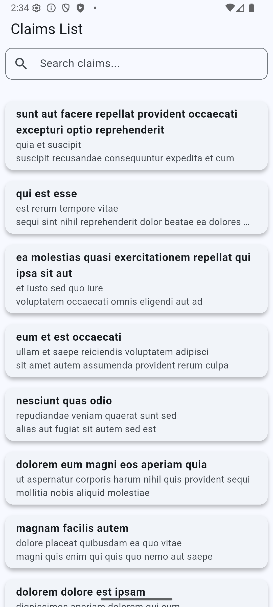

# Insurance Claim App

A Flutter application that displays insurance claims using mock data from the JSONPlaceholder API.

---


## 💻 Setup Instructions

1. **Clone the repository:**
   ```bash
   git clone https://github.com/irfanramadhiya/flutter_insurance_claim.git
   ```

2. **Install dependencies:**
   ```bash
   flutter pub get
   ```

3. **Run the app:**
   ```bash
   flutter run
   ```

4. **Run tests:**
   ```bash
   flutter test
   ```

---

## 📂 Folder Structure

- **assets/screenshots/**  
  Stores screenshots used in the README or for other documentation purposes.

- **lib/network/**  
  Contains all services responsible for API calls and networking logic.

- **lib/screens/**  
  Contains folders for each screen, including both the **view** (UI) and **viewmodel** (logic/state management).

- **lib/model/**  
  Contains all the data models used across the app.

- **test/network/**  
  Contains unit tests for services.

- **test/screens/**  
  Contains unit/widget tests for screens.

- **test/model/**  
  Contains unit tests for data models.

---

## 📸 Screenshots

### Claim List Screen
Contains the main list of claims.


### Claim List Screen (Filtered)
Shows the list after the user types in the search bar.


### Claim Detail Screen
Displays detailed information about a single claim.

